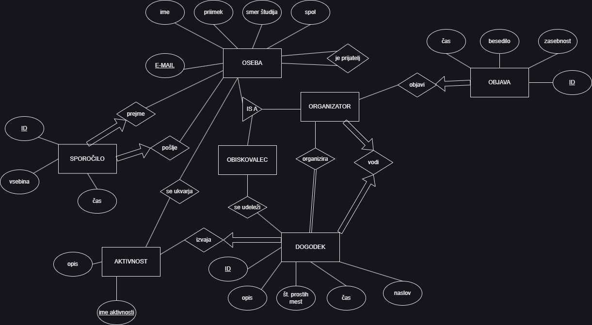

# OPB
Naredil sem aplikacijo za lažje organiziranje dogodkov. Na začetku se lahko uporabnik vpiše kot obiskovalec ali organizator. Organizator lahko dodaja in vodi dogodke, dodaja objave, obiskovalec pa se lahko prijavlja na dogodke. Med seboj si lahko pošiljajo tudi sporočila. 

